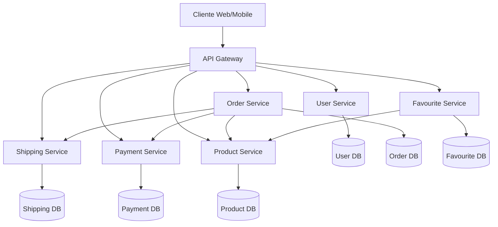

# E-commerce Microservices Application

## Arquitectura

Esta aplicación de comercio electrónico está construida siguiendo una arquitectura de microservicios, donde cada componente funcional está implementado como un servicio independiente.

### Servicios

- **user-service**: Gestión de usuarios y autenticación
- **product-service**: Catálogo de productos y gestión de inventario
- **order-service**: Procesamiento y gestión de órdenes
- **payment-service**: Procesamiento de pagos
- **shipping-service**: Gestión de envíos
- **favourite-service**: Gestión de productos favoritos

### Diagrama de Arquitectura



## Tecnologías Utilizadas

- **Backend**: Spring Boot, Spring Cloud
- **Base de Datos**: PostgreSQL
- **CI/CD**: Jenkins, SonarQube
- **Contenedores**: Docker, Kubernetes
- **Monitoreo**: Prometheus, Grafana
- **Logging**: ELK Stack
- **Testing**: JUnit, Locust

## Requisitos

- Java 17+
- Docker
- Kubernetes
- Jenkins
- PostgreSQL
- Maven

## Instalación y Configuración

### 1. Clonar el Repositorio

```bash
git clone https://github.com/your-org/ecommerce-microservice-backend-app.git
cd ecommerce-microservice-backend-app
```

### 2. Configurar Variables de Entorno

Crear un archivo `.env` en la raíz del proyecto:

```env
DB_USERNAME=your_db_user
DB_PASSWORD=your_db_password
SONAR_TOKEN=your_sonar_token
DOCKER_REGISTRY=your_registry
```

### 3. Iniciar Servicios de Infraestructura

```bash
# Iniciar servicios de infraestructura
kubectl apply -f infrastructure/

# Verificar que los servicios estén corriendo
kubectl get pods -n infrastructure
```

### 4. Desplegar Microservicios

```bash
# Desplegar todos los servicios en staging
kubectl apply -f pipelines/kubernetes/stage/

# Verificar el estado de los servicios
kubectl get pods -n stage
```

## Desarrollo

### Estructura del Proyecto

```
├── infrastructure/           # Configuración de infraestructura
├── pipelines/               # Pipelines CI/CD
│   ├── jenkins/            # Pipelines de Jenkins
│   └── kubernetes/         # Manifiestos de Kubernetes
├── services/               # Código fuente de microservicios
└── docs/                   # Documentación adicional
```

### Flujo de Desarrollo

1. Crear rama feature: `git checkout -b feature/nueva-funcionalidad`
2. Desarrollar y probar localmente
3. Ejecutar pruebas: `./mvnw clean verify`
4. Crear PR a develop
5. Revisión de código y CI/CD
6. Merge a develop

## Pruebas

### Pruebas Unitarias y de Integración

```bash
# Ejecutar todas las pruebas
./mvnw clean verify

# Ejecutar pruebas específicas
./mvnw test -Pintegration-test
```

### Pruebas de Rendimiento

```bash
# Ejecutar pruebas de carga con Locust
cd service-name/src/test/python
locust -f locustfile.py
```

## Monitoreo y Observabilidad

### Acceso a Dashboards

- Grafana: http://grafana.your-domain.com
- Prometheus: http://prometheus.your-domain.com
- Kibana: http://kibana.your-domain.com

### Alertas

Las alertas están configuradas en Prometheus AlertManager y se envían a:
- Slack
- Email
- PagerDuty

## Seguridad

### RBAC

Los roles y permisos están definidos en `infrastructure/rbac/`:
- Desarrolladores
- Operadores
- Administradores

### Network Policies

Políticas de red implementadas:
- Aislamiento entre namespaces
- Restricción de comunicación entre servicios
- Acceso limitado a bases de datos

## Backup y Recuperación

### Backup Automático

```bash
# Ejecutar backup manual
./scripts/backup.sh

# Restaurar desde backup
./scripts/restore.sh <backup-file>
```

### Disaster Recovery

1. Activar sitio DR: `./scripts/activate-dr.sh`
2. Verificar servicios: `./scripts/verify-dr.sh`
3. Redirigir tráfico: `./scripts/switch-traffic.sh`

## Troubleshooting

### Problemas Comunes

1. **Servicio no responde**
```bash
   # Verificar logs
   kubectl logs -f <pod-name> -n stage
   
   # Verificar estado
   kubectl describe pod <pod-name> -n stage
   ```

2. **Error de Base de Datos**
   ```bash
   # Verificar conexión
   kubectl exec -it <db-pod> -- psql -U <user> -d <database>
   ```

3. **Problemas de Red**
```bash
   # Probar conectividad
   kubectl exec -it <pod-name> -- curl <service-name>
   ```

## Mantenimiento

### Tareas Programadas

- Limpieza de logs: Diaria
- Backup de DB: Cada 6 horas
- Actualización de certificados: Mensual

### Actualizaciones

```bash
# Actualizar servicios
./scripts/update-services.sh

# Rollback en caso de problemas
./scripts/rollback.sh <version>
```

## Contribución

1. Fork del repositorio
2. Crear rama feature
3. Commit cambios
4. Push a la rama
5. Crear Pull Request

## Licencia

Este proyecto está bajo la licencia MIT. Ver [LICENSE](LICENSE) para más detalles.
